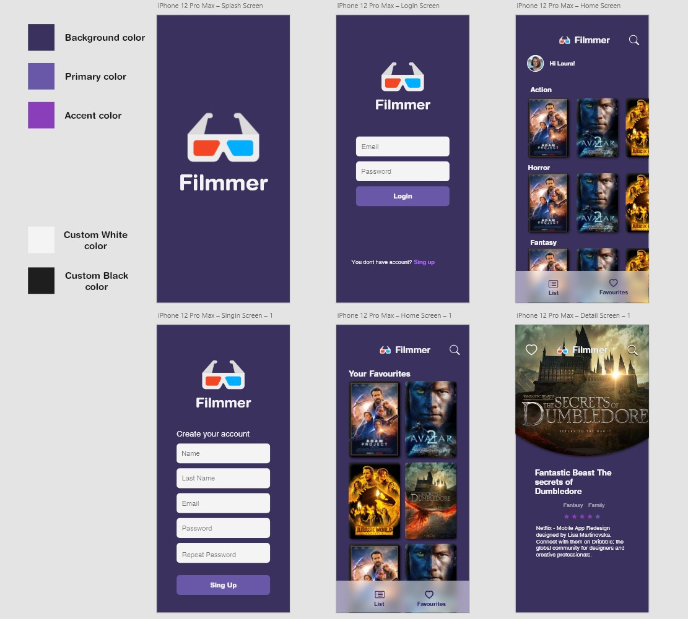

# Learning Swift

In this reposiroty I will upload my learning in swift. This is from a course with InfinixSoft Company.

## Exercise 1

This directory contains six exercises about OOP.

### Points

    1. Operation with two numbers
    2. Addition and substraction of an array
    3. Search a name in a diary
    4. Compare Strings
    5. Password strong evaluation
    6. Password strong evaluation with regular expresions

## Exercise 2

In this exercise, there is an app of a login validated in a swift dictionary. This app use a navigation controller for redirect the loged user to the home view

## Trabajo Practico 3

Esta app muestra una lista de peliculas separadas por genero. Y permite ver a detalle cada pelicula, presentando su titulo, calificacion y sinopsis.

**Diseño UI** - diseñado con Adobe XD

### Implementaciones
- **Patron MVC**
- **UITAbleView**, para presentar las peliculas por genero.
- **UICollectionView**, para presentar cada pelicula dentro de la celda de la tabla.
- **Extensions**, para extender las funcionalidades de una clase asi tener el codigo mas ordenado y legible.
- **Closures**, para pasar a la collectionCell el navigationController del Home.
- **Librerias externas**, SideMenu para implementar el menu lateral que permite cerrar sesion.
- **UserDefaults**, para persistir datos del usuario como nombre y foto de perfil.

App en funcionamiento

## Trabajo Practico 4
Se implementó Alamofire para llamar a la api de registro y login.
Tambien cuenta con una seccion de busqueda de peliculas, usando api de omdbapi.com
Se usó libreririas externas:
- PopupDialog, para mensajes popups
- Kingfisher, para la descarga de imagenes

